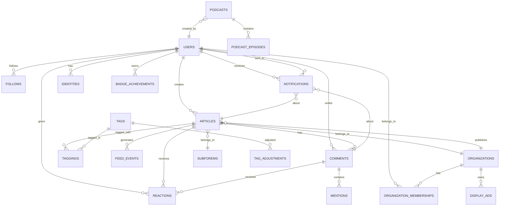
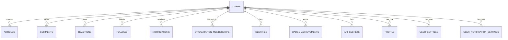
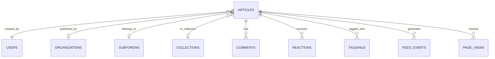

# Database Schema Diagram

Complete database schema documentation with tables, relationships, indexes, and views.

## Table of Contents

1. [Overview](#overview)
2. [Core Entity Relationships](#core-entity-relationships)
3. [Detailed Table Structure](#detailed-table-structure)
4. [Indexes Documentation](#indexes-documentation)
5. [Foreign Key Relationships](#foreign-key-relationships)
6. [Database Triggers](#database-triggers)
7. [Views](#views)

---

## Overview

**Database**: PostgreSQL  
**Extensions Used**:
- `citext` - Case-insensitive text
- `ltree` - Labeled tree structure
- `pg_trgm` - Trigram similarity (for text search)
- `pgcrypto` - Cryptographic functions
- `plpgsql` - Procedural language
- `unaccent` - Remove accents from text

**Total Tables**: ~80+ tables  
**Key Domains**:
- Users & Authentication
- Content (Articles, Comments)
- Social (Reactions, Follows, Notifications)
- Organizations
- Tags & Categorization
- Podcasts
- Moderation & Feedback
- Analytics & Tracking

---

## Core Entity Relationships

### High-Level ER Diagram



---

## Detailed Table Structure

### Core User Tables

#### `users`
**Primary Key**: `id`  
**Purpose**: Main user accounts

**Key Columns**:
- `id` (bigint, PK)
- `username` (string, indexed)
- `email` (citext, indexed)
- `name` (string)
- `profile_image_url` (string)
- `created_at`, `updated_at` (timestamps)

**Indexes**:
- `index_users_on_email` (unique)
- `index_users_on_username` (unique)
- `index_users_on_confirmation_token`
- `index_users_on_reset_password_token`
- `index_users_on_unlock_token`

#### `profiles`
**Primary Key**: `id`  
**Foreign Key**: `user_id` → `users.id`

**Key Columns**:
- `user_id` (bigint, FK, unique)
- `summary` (text)
- `location` (string)
- `website_url` (string)
- `data` (jsonb)

**Indexes**:
- `index_profiles_on_user_id` (unique)

#### `identities`
**Primary Key**: `id`  
**Foreign Key**: `user_id` → `users.id`

**Purpose**: OAuth identities (GitHub, Twitter, etc.)

**Key Columns**:
- `user_id` (bigint, FK)
- `provider` (string)
- `uid` (string)
- `auth_data_dump` (jsonb)

**Indexes**:
- `index_identities_on_user_id`
- `index_identities_on_provider_and_uid` (unique)

---

### Content Tables

#### `articles`
**Primary Key**: `id`  
**Foreign Keys**: 
- `user_id` → `users.id`
- `organization_id` → `organizations.id`
- `subforem_id` → `subforems.id`
- `collection_id` → `collections.id`

**Purpose**: Blog posts/articles

**Key Columns**:
- `id` (bigint, PK)
- `user_id` (bigint, FK)
- `title` (string)
- `slug` (string)
- `body_markdown` (text)
- `body_html` (text)
- `published` (boolean, default: false)
- `published_at` (datetime)
- `path` (string)
- `canonical_url` (string)
- `hotness_score` (integer)
- `score` (integer)
- `comments_count` (integer)
- `reactions_count` (integer)
- `positive_reactions_count` (integer)
- `public_reactions_count` (integer)
- `page_views_count` (integer)
- `organic_page_views_count` (integer)
- `reading_list_document` (tsvector) - Full-text search

**Critical Indexes**:
- `index_articles_on_user_id`
- `index_articles_on_published` (where published = true)
- `index_articles_on_published_at`
- `index_articles_on_hotness_score`
- `index_articles_on_score`
- `index_articles_on_path`
- `index_articles_on_slug_and_user_id` (unique)
- `index_articles_on_canonical_url` (unique, where published = true)
- `index_articles_on_reading_list_document` (GIN, for full-text search)
- `index_articles_on_cached_tag_list` (GIN, trigram)
- `index_articles_on_cached_label_list` (GIN, array)
- `index_articles_on_subforem_published_score_published_at` (composite)
- `index_articles_on_user_id_published_score_published_at` (composite, where published = true)
- `index_articles_on_featured_published_published_at` (composite, where published = true)

#### `comments`
**Primary Key**: `id`  
**Foreign Key**: `user_id` → `users.id`

**Purpose**: Comments on articles

**Key Columns**:
- `id` (bigint, PK)
- `user_id` (bigint, FK)
- `commentable_type` (string) - Polymorphic
- `commentable_id` (bigint) - Polymorphic
- `body_markdown` (text)
- `body_html` (text)
- `deleted` (boolean)
- `score` (integer)
- `reactions_count` (integer)

**Indexes**:
- `index_comments_on_user_id`
- `index_comments_on_commentable_type_and_commentable_id`
- `index_comments_on_score`
- `index_comments_on_deleted`

---

### Social Interaction Tables

#### `reactions`
**Primary Key**: `id`  
**Foreign Keys**:
- `user_id` → `users.id`
- `reactable_type` (polymorphic)
- `reactable_id` (polymorphic)

**Purpose**: Likes/reactions on content

**Key Columns**:
- `user_id` (bigint, FK)
- `reactable_type` (string)
- `reactable_id` (bigint)
- `category` (string) - like, readinglist, etc.
- `points` (integer)

**Indexes**:
- `index_reactions_on_user_id`
- `index_reactions_on_reactable_type_and_reactable_id`
- `index_reactions_on_category`
- `index_reactions_on_user_id_and_reactable` (unique, prevents duplicates)

#### `follows`
**Primary Key**: `id`

**Purpose**: User follows (users, tags, etc.)

**Key Columns**:
- `follower_type` (string) - Polymorphic
- `follower_id` (bigint) - Polymorphic
- `followable_type` (string) - Polymorphic
- `followable_id` (bigint) - Polymorphic

**Indexes**:
- `index_follows_on_follower_type_and_follower_id`
- `index_follows_on_followable_type_and_followable_id`
- `index_follows_on_follower_and_followable` (unique)

#### `notifications`
**Primary Key**: `id`  
**Foreign Keys**:
- `user_id` → `users.id`
- `notifiable_type` (polymorphic)
- `notifiable_id` (polymorphic)
- `organization_id` → `organizations.id`

**Purpose**: User notifications

**Key Columns**:
- `user_id` (bigint, FK)
- `notifiable_type` (string)
- `notifiable_id` (bigint)
- `action` (string)
- `json_data` (jsonb)
- `read` (boolean, default: false)

**Indexes**:
- `index_notifications_on_user_id`
- `index_notifications_on_notifiable_type_and_notifiable_id`
- `index_notifications_on_read`
- `index_notifications_on_user_id_and_read` (composite)

---

### Organization Tables

#### `organizations`
**Primary Key**: `id`

**Purpose**: User organizations

**Key Columns**:
- `id` (bigint, PK)
- `name` (string)
- `slug` (string, unique)
- `profile_image_url` (string)
- `summary` (text)

**Indexes**:
- `index_organizations_on_slug` (unique)

#### `organization_memberships`
**Primary Key**: `id`  
**Foreign Keys**:
- `user_id` → `users.id`
- `organization_id` → `organizations.id`

**Purpose**: User-organization relationships

**Key Columns**:
- `user_id` (bigint, FK)
- `organization_id` (bigint, FK)
- `type_of_user` (string) - admin, member, etc.

**Indexes**:
- `index_organization_memberships_on_user_id`
- `index_organization_memberships_on_organization_id`
- `index_organization_memberships_on_user_and_org` (unique)

---

### Tagging System

#### `tags`
**Primary Key**: `id`

**Purpose**: Content tags

**Key Columns**:
- `id` (bigint, PK)
- `name` (string, unique)
- `slug` (string, unique)
- `taggings_count` (integer)
- `hotness_score` (integer)

**Indexes**:
- `index_tags_on_name` (unique)
- `index_tags_on_slug` (unique)
- `index_tags_on_hotness_score`

#### `taggings`
**Primary Key**: `id`  
**Foreign Keys**:
- `tag_id` → `tags.id`
- `taggable_type` (polymorphic)
- `taggable_id` (polymorphic)

**Purpose**: Tag associations

**Key Columns**:
- `tag_id` (bigint, FK)
- `taggable_type` (string)
- `taggable_id` (bigint)
- `context` (string)

**Indexes**:
- `index_taggings_on_tag_id`
- `index_taggings_on_taggable_type_and_taggable_id`
- `index_taggings_on_context`

---

### Podcast Tables

#### `podcasts`
**Primary Key**: `id`  
**Foreign Key**: `creator_id` → `users.id`

**Purpose**: Podcast shows

**Key Columns**:
- `id` (bigint, PK)
- `title` (string)
- `slug` (string, unique)
- `feed_url` (string, unique)
- `creator_id` (bigint, FK)
- `main_color_hex` (string)

**Indexes**:
- `index_podcasts_on_slug` (unique)
- `index_podcasts_on_feed_url` (unique)
- `index_podcasts_on_creator_id`

#### `podcast_episodes`
**Primary Key**: `id`  
**Foreign Key**: `podcast_id` → `podcasts.id`

**Purpose**: Individual podcast episodes

**Key Columns**:
- `id` (bigint, PK)
- `podcast_id` (bigint, FK)
- `title` (string)
- `media_url` (string)
- `published_at` (datetime)
- `duration_in_seconds` (integer)

**Indexes**:
- `index_podcast_episodes_on_podcast_id`
- `index_podcast_episodes_on_published_at`
- `index_podcast_episodes_on_media_url`

---

### Moderation Tables

#### `feedback_messages`
**Primary Key**: `id`  
**Foreign Keys**:
- `reporter_id` → `users.id`
- `offender_id` → `users.id`
- `affected_id` → `users.id`

**Purpose**: User reports/feedback

**Key Columns**:
- `id` (bigint, PK)
- `reporter_id` (bigint, FK)
- `offender_id` (bigint, FK)
- `affected_id` (bigint, FK)
- `message` (text)
- `status` (string)
- `category` (string)

**Indexes**:
- `index_feedback_messages_on_reporter_id`
- `index_feedback_messages_on_offender_id`
- `index_feedback_messages_on_affected_id`
- `index_feedback_messages_on_status`

#### `audit_logs`
**Primary Key**: `id`  
**Foreign Key**: `user_id` → `users.id` (optional)

**Purpose**: Admin action audit trail

**Key Columns**:
- `id` (bigint, PK)
- `user_id` (bigint, FK, nullable)
- `category` (string)
- `slug` (string)
- `data` (jsonb)
- `roles` (string)

**Indexes**:
- `index_audit_logs_on_user_id`
- `index_audit_logs_on_category`
- `index_audit_logs_on_slug`

---

### Analytics Tables

#### `ahoy_visits`
**Primary Key**: `id`  
**Foreign Key**: `user_id` → `users.id`

**Purpose**: User visit tracking

**Key Columns**:
- `id` (bigint, PK)
- `user_id` (bigint, FK)
- `visit_token` (string, unique)
- `visitor_token` (string)
- `started_at` (datetime)

**Indexes**:
- `index_ahoy_visits_on_user_id`
- `index_ahoy_visits_on_visit_token` (unique)
- `index_ahoy_visits_on_visitor_token_and_started_at`

#### `ahoy_events`
**Primary Key**: `id`  
**Foreign Keys**:
- `user_id` → `users.id`
- `visit_id` → `ahoy_visits.id`

**Purpose**: Event tracking

**Key Columns**:
- `id` (bigint, PK)
- `user_id` (bigint, FK)
- `visit_id` (bigint, FK)
- `name` (string)
- `properties` (jsonb)
- `time` (datetime)

**Indexes**:
- `index_ahoy_events_on_user_id`
- `index_ahoy_events_on_visit_id`
- `index_ahoy_events_on_name_and_time`
- `index_ahoy_events_on_properties` (GIN, jsonb_path_ops)

#### `page_views`
**Primary Key**: `id`  
**Foreign Keys**:
- `user_id` → `users.id`
- `article_id` → `articles.id`

**Purpose**: Page view tracking

**Key Columns**:
- `id` (bigint, PK)
- `user_id` (bigint, FK)
- `article_id` (bigint, FK)
- `counts_for_number_of_views` (integer)
- `time_tracked_in_seconds` (integer)
- `created_at` (datetime)

**Indexes**:
- `index_page_views_on_user_id`
- `index_page_views_on_article_id`
- `index_page_views_on_created_at`

---

### GDPR & User Management

#### `users_gdpr_delete_requests`
**Primary Key**: `id`

**Purpose**: Track deleted users for GDPR compliance

**Key Columns**:
- `id` (bigint, PK)
- `user_id` (bigint) - References deleted user
- `email` (string)
- `username` (string)
- `created_at`, `updated_at` (timestamps)

**Indexes**:
- None (table is temporary, records deleted after admin confirmation)

---

## Indexes Documentation

### Index Types Used

1. **B-Tree Indexes** (default)
   - Standard indexes for equality and range queries
   - Used for: foreign keys, unique constraints, common queries

2. **GIN Indexes** (Generalized Inverted Index)
   - Used for: arrays, JSONB, full-text search
   - Examples:
     - `articles.cached_label_list` (array)
     - `articles.cached_tag_list` (trigram)
     - `articles.reading_list_document` (tsvector)
     - `ahoy_events.properties` (jsonb)

3. **Unique Indexes**
   - Enforce uniqueness constraints
   - Examples:
     - `users.email`
     - `users.username`
     - `articles.slug_and_user_id`
     - `articles.canonical_url` (partial, where published = true)

4. **Partial Indexes**
   - Index only rows matching a condition
   - Examples:
     - `articles` indexes with `where published = true`
     - `articles.canonical_url` (only published articles)

5. **Composite Indexes**
   - Multiple columns for complex queries
   - Examples:
     - `articles_on_subforem_published_score_published_at`
     - `articles_on_user_id_published_score_published_at`
     - `notifications_on_user_id_and_read`

### Critical Indexes by Table

#### Articles Table

**Performance-Critical Indexes**:
```sql
-- Published articles feed
index_articles_on_featured_published_published_at 
  (featured, published, published_at DESC) 
  WHERE published = true

-- User's published articles
index_articles_on_user_id_published_score_published_at 
  (user_id, published, score, published_at DESC) 
  WHERE published = true

-- Subforem feed
index_articles_on_subforem_published_score_published_at 
  (subforem_id, published, score, published_at)

-- Full-text search
index_articles_on_reading_list_document 
  USING gin (reading_list_document)

-- Tag search
index_articles_on_cached_tag_list 
  USING gin (cached_tag_list gin_trgm_ops)
```

#### Users Table

**Critical Indexes**:
```sql
-- Authentication
index_users_on_email (unique)
index_users_on_username (unique)
index_users_on_confirmation_token
index_users_on_reset_password_token
```

#### Notifications Table

**Critical Indexes**:
```sql
-- User's unread notifications
index_notifications_on_user_id_and_read (user_id, read)

-- Notification lookup
index_notifications_on_notifiable_type_and_notifiable_id
```

#### Reactions Table

**Critical Indexes**:
```sql
-- Prevent duplicate reactions
index_reactions_on_user_id_and_reactable 
  (user_id, reactable_type, reactable_id) UNIQUE

-- Reaction lookup
index_reactions_on_reactable_type_and_reactable_id
```

---

## Foreign Key Relationships

### User Relationships



### Article Relationships



### Foreign Key Constraints

**Cascade Delete** (child deleted when parent deleted):
- `articles` → `users` (CASCADE)
- `comments` → `users` (CASCADE)
- `reactions` → `users` (CASCADE)
- `notifications` → `users` (CASCADE)
- `ahoy_events` → `users` (CASCADE)
- `ahoy_visits` → `users` (CASCADE)

**Nullify** (child's FK set to NULL when parent deleted):
- `articles` → `organizations` (NULLIFY)
- `articles` → `collections` (NULLIFY)
- `audit_logs` → `users` (NULLIFY)

**Restrict** (prevent deletion if children exist):
- `credits` → `organizations` (RESTRICT)

---

## Database Triggers

### Reading List Document Trigger

**Name**: `update_reading_list_document`  
**Table**: `articles`  
**When**: Before INSERT or UPDATE  
**Purpose**: Automatically update full-text search vector

**Function**:
```sql
CREATE TRIGGER update_reading_list_document
BEFORE INSERT OR UPDATE ON articles
FOR EACH ROW
EXECUTE FUNCTION update_reading_list_document();

-- The trigger updates reading_list_document tsvector with:
-- - Title (weight A)
-- - Tags (weight B)
-- - Body markdown (weight C)
-- - User name/username (weight D)
-- - Organization name (weight D)
```

**Index**: `index_articles_on_reading_list_document` (GIN) for fast full-text search

---

## Views

### Current Views

**Note**: This schema does not currently define explicit database views. Views may be created:
1. Through migrations (check `db/migrate/` for `create_view` statements)
2. Directly in the database
3. As materialized views for performance

### Recommended Views

For performance optimization, consider creating views for:

1. **Published Articles Feed**
   ```sql
   CREATE VIEW published_articles_feed AS
   SELECT id, title, user_id, published_at, score, hotness_score
   FROM articles
   WHERE published = true
   ORDER BY published_at DESC;
   ```

2. **User Activity Summary**
   ```sql
   CREATE VIEW user_activity_summary AS
   SELECT 
     u.id,
     u.username,
     COUNT(DISTINCT a.id) as articles_count,
     COUNT(DISTINCT c.id) as comments_count,
     COUNT(DISTINCT r.id) as reactions_count
   FROM users u
   LEFT JOIN articles a ON a.user_id = u.id AND a.published = true
   LEFT JOIN comments c ON c.user_id = u.id
   LEFT JOIN reactions r ON r.user_id = u.id
   GROUP BY u.id, u.username;
   ```

3. **Tag Popularity**
   ```sql
   CREATE VIEW tag_popularity AS
   SELECT 
     t.id,
     t.name,
     t.slug,
     COUNT(DISTINCT tg.taggable_id) as articles_count,
     t.hotness_score
   FROM tags t
   LEFT JOIN taggings tg ON tg.tag_id = t.id
   WHERE tg.taggable_type = 'Article'
   GROUP BY t.id, t.name, t.slug, t.hotness_score;
   ```

---

## Index Performance Notes

### Most Frequently Used Indexes

1. **Articles Feed Queries**:
   - `index_articles_on_featured_published_published_at`
   - `index_articles_on_user_id_published_score_published_at`
   - `index_articles_on_subforem_published_score_published_at`

2. **Search Queries**:
   - `index_articles_on_reading_list_document` (GIN)
   - `index_articles_on_cached_tag_list` (GIN, trigram)

3. **User Lookups**:
   - `index_users_on_email`
   - `index_users_on_username`

4. **Notification Queries**:
   - `index_notifications_on_user_id_and_read`

### Index Maintenance

**Monitor**:
- Index usage with `pg_stat_user_indexes`
- Index bloat with `pg_stat_user_tables`
- Query performance with `EXPLAIN ANALYZE`

**Maintenance**:
- Regular `VACUUM ANALYZE` on frequently updated tables
- `REINDEX` on GIN indexes if they become bloated
- Consider partial indexes for filtered queries

---

## Schema Statistics

- **Total Tables**: ~80+
- **Total Indexes**: ~200+
- **Foreign Keys**: ~100+
- **Unique Constraints**: ~30+
- **GIN Indexes**: ~10+ (for arrays, JSONB, full-text search)
- **Partial Indexes**: ~15+ (optimized for common queries)

---

## Additional Resources

- **Schema File**: `db/schema.rb`
- **Migrations**: `db/migrate/`
- **Database Documentation**: PostgreSQL 13+ features used
- **Query Optimization**: See `docs/feed_query_optimization.md`

---

**Last Updated**: Based on schema version 2025_11_07_175200

