# GDPR Delete Request Flow - Complete Explanation

## Overview

The `GDPRDeleteRequest` system is a two-phase deletion process designed to comply with GDPR requirements. It ensures that user data is properly deleted from the main application database, and then provides a tracking mechanism for administrators to confirm that external data (in third-party services, mailing lists, etc.) has also been removed.

## Database Schema

The `users_gdpr_delete_requests` table stores:
* `user_id` (integer, required) - The ID of the deleted user
* `email` (string, required) - The user's email address
* `username` (string) - The user's username
* `created_at` / `updated_at` (timestamps)

**Note**: The model uses `table_name_prefix` of `"users_"` , so the model `GDPRDeleteRequest` maps to the table `users_gdpr_delete_requests` .

## Complete Flow: From Beginning to End

### Phase 1: User Deletion (Automatic)

#### Step 1: User Initiates Deletion

* User requests account deletion through `UsersController#request_destroy`
* System validates email exists and no deletion is in progress
* A deletion token is generated and stored in cache

#### Step 2: User Confirms Deletion

* User clicks confirmation link with token (`UsersController#confirm_destroy`)
* Token is validated
* `UsersController#full_delete` is called

#### Step 3: Background Job Enqueued

* `Users::DeleteWorker.perform_async(user_id)` is enqueued
* User is signed out immediately
* User sees "deletion scheduled" message

#### Step 4: Background Worker Executes ( `Users::DeleteWorker` )

The worker performs the following operations **in order**:

1. **Finds the user** from the database
2. **Calls `Users::Delete.call(user)`** which performs comprehensive deletion:

   **a. Deletes Comments** ( `DeleteComments` )
   - Removes all user's comments from the system

   **b. Deletes Articles** ( `DeleteArticles` )
   - Removes all user's articles

   **c. Deletes Podcasts** ( `DeletePodcasts` )
   - Removes podcasts owned by the user

   **d. Deletes User Activity** ( `DeleteActivity` )
   - Removes social media connections (GitHub repos)
   - Clears profile information (notifications, reactions, follows, mentions, badges, collections, credits, organization memberships, profile pins)
   - Deletes API secrets
   - Removes blocks, notes, billboard events, email messages, HTML variants, poll data
   - Clears response templates
   - Destroys listings
   - Resolves/removes feedback messages
   - **Important**: Profile data is anonymized (summary, location, website_url cleared; social usernames set to empty strings)

   **e. Cancels Stripe Subscriptions** ( `CancelStripeSubscriptions` )
   - Cancels any active payment subscriptions

   **f. Removes from Mailchimp** ( `user.remove_from_mailchimp_newsletters` )
   - Unsubscribes user from newsletters

   **g. Busts Edge Cache** ( `EdgeCache::Bust` )
   - Clears cached user profile page

   **h. Creates Suspended Username** (if user was spam/suspended)
   - Prevents username reuse for problematic accounts

   **i. Destroys User Record** ( `user.destroy` )
   - **At this point, the user record is permanently deleted from the database**
   - The user object still exists in memory with its attributes

   **j. Clears Destroy Token** from cache

3. **Creates GDPRDeleteRequest Record**

```ruby
   GDPRDeleteRequest.create(
     user_id: user.id,      # Still available from in-memory object
     email: user.email,     # Still available from in-memory object
     username: user.username # Still available from in-memory object
   )
   ```

   **Critical Note**: This happens AFTER `user.destroy` , so the user_id references a non-existent user. This is intentional - it's a record of a deleted user.

4. **Sends Confirmation Email** (if not admin_delete and email exists)
   - Uses `NotifyMailer.account_deleted_email`

   - Passes name and email as parameters (not the user object, since it's destroyed)

5. **Error Handling**
   - If any error occurs, it's logged to Honeybadger
   - Stats are tracked via ForemStatsClient

### Phase 2: Admin Confirmation (Manual)

#### Step 5: Admin Views Pending Requests

* Admin navigates to `/admin/member_manager/gdpr_delete_requests`
* `Admin::GDPRDeleteRequestsController#index` displays all pending requests
* Uses `Admin::GDPRDeleteRequestsQuery` for search/filtering (by email or username)
* Shows paginated list (50 per page) with:
  + Username
  + Email address
  + Deletion date (created_at)
  + "Deleted" button to confirm

#### Step 6: Admin Confirms External Data Deletion

* Admin clicks "Deleted" button for a specific request
* JavaScript modal appears asking: "Are you sure you have deleted all external data?"
* Admin confirms by clicking "Yes, mark as deleted"

#### Step 7: Request Destroyed ( `Admin::GDPRDeleteRequestsController#destroy` )

* Finds the `GDPRDeleteRequest` by ID
* Calls `@gdpr_delete_request.destroy` - **permanently removes the record**
* Creates an `AuditLog` entry:

```ruby
  AuditLog.create(
    user: current_user,           # Admin who confirmed
    category: "admin.gdpr_delete.confirm",
    roles: current_user.roles_name,
    slug: "gdpr_delete_confirm",
    data: { user_id: @gdpr_delete_request.user_id } # Original deleted user's ID
  )
  ```

* Shows success flash message
* Redirects back to index page

## How Records Are Affected

### Records Deleted (Permanently Removed)

1. **User Record** - Completely destroyed
2. **User's Comments** - All deleted
3. **User's Articles** - All deleted
4. **User's Podcasts** - All deleted
5. **User Activity Records**:
   - API secrets
   - Blocks (both directions)
   - Notes
   - Billboard events
   - Email messages
   - HTML variants
   - Poll skips and votes
   - Response templates
   - Listings
   - GitHub repos
   - Notifications
   - Reactions
   - Follows (both follower and followable)
   - Mentions
   - Badge achievements
   - Collections
   - Credits
   - Organization memberships
   - Profile pins
   - Feedback messages (reporter/affected)

### Records Modified (Anonymized/Cleared)

1. **User Profile** - Summary, location, website_url cleared; social usernames emptied
2. **Created Podcasts** - `creator_id` set to `nil` (nullified)
3. **Feedback Messages** - Offender messages marked as "Resolved"

### Records Preserved (For Audit/Compliance)

1. **AuditLog** - User's audit logs remain but `user_id` becomes `nil` (due to `dependent: :nullify`)
2. **GDPRDeleteRequest** - Created as a tracking record (deleted only when admin confirms)

### Records in External Systems

* **Mailchimp** - User removed from newsletters
* **Stripe** - Subscriptions cancelled
* **Edge Cache** - User profile page cache cleared

## Important Design Decisions

1. **Two-Phase Process**: The system separates internal deletion (automatic) from external data deletion confirmation (manual) because external systems may require manual intervention.

2. **GDPRDeleteRequest Created After User Destruction**: The request is created AFTER the user is destroyed, storing the user_id, email, and username for reference. This allows admins to track which users need external data cleanup even though the user record no longer exists.

3. **Audit Trail**: Every admin confirmation creates an AuditLog entry, providing a complete audit trail of who confirmed what deletion and when.

4. **Error Resilience**: The worker has retry logic (10 retries) and comprehensive error handling to ensure deletions complete even if transient errors occur.

5. **Search Functionality**: Admins can search by email or username to quickly find specific deletion requests.

## Flow Diagram

```mermaid
flowchart TD
    Start([User Requests Account Deletion]) --> ValidateEmail{User has email?}
    ValidateEmail -->|No| Error1[Show Error: Provide Email]
    ValidateEmail -->|Yes| CheckInProgress{Deletion in Progress?}
    CheckInProgress -->|Yes| Error2[Show Error: Deletion Already In Progress]
    CheckInProgress -->|No| GenerateToken[Generate Deletion Token<br/>Store in Cache]

    GenerateToken --> SendEmail[Send Confirmation Email]
    SendEmail --> WaitConfirmation[User Clicks Confirmation Link]

    WaitConfirmation --> ValidateToken{Token Valid?}
    ValidateToken -->|No| Error3[Show Error: Token Expired/Invalid]
    ValidateToken -->|Yes| EnqueueWorker[Enqueue Users::DeleteWorker<br/>Sign Out User]

    EnqueueWorker --> WorkerStart[Background Worker Starts]

    WorkerStart --> FindUser[Find User by ID]
    FindUser --> UserExists{User Exists?}
    UserExists -->|No| WorkerEnd[Worker Exits]
    UserExists -->|Yes| DeleteProcess[Users::Delete.call]

    DeleteProcess --> DeleteComments[Delete Comments]
    DeleteComments --> DeleteArticles[Delete Articles]
    DeleteArticles --> DeletePodcasts[Delete Podcasts]
    DeletePodcasts --> DeleteActivity[Delete User Activity]

    DeleteActivity --> DeleteActivityDetails[Delete:<br/>- API Secrets<br/>- Blocks<br/>- Notes<br/>- Notifications<br/>- Reactions<br/>- Follows<br/>- Mentions<br/>- Badges<br/>- Collections<br/>- Credits<br/>- Profile Pins<br/>- GitHub Repos<br/>- Listings<br/>- Poll Data<br/>- Response Templates]

    DeleteActivityDetails --> AnonymizeProfile[Anonymize Profile:<br/>- Clear summary/location/website<br/>- Empty social usernames]

    AnonymizeProfile --> CancelStripe[Cancel Stripe Subscriptions]
    CancelStripe --> RemoveMailchimp[Remove from Mailchimp]
    RemoveMailchimp --> BustCache[Clear Edge Cache]
    BustCache --> CheckSpam{User Spam/Suspended?}
    CheckSpam -->|Yes| CreateSuspendedUsername[Create Suspended Username]
    CheckSpam -->|No| DestroyUser[Destroy User Record<br/>⚠️ User Permanently Deleted]
    CreateSuspendedUsername --> DestroyUser

    DestroyUser --> ClearToken[Clear Destroy Token from Cache]
    ClearToken --> CreateGDPRRequest[Create GDPRDeleteRequest<br/>user_id, email, username]

    CreateGDPRRequest --> CheckAdminDelete{Admin Delete?}
    CheckAdminDelete -->|Yes| WorkerComplete[Worker Complete]
    CheckAdminDelete -->|No| CheckEmail{Email Exists?}
    CheckEmail -->|No| WorkerComplete
    CheckEmail -->|Yes| SendDeletionEmail[Send Account Deleted Email]
    SendDeletionEmail --> WorkerComplete

    WorkerComplete --> AdminPhase[PHASE 2: Admin Confirmation]

    AdminPhase --> AdminView[Admin Views<br/>/admin/member_manager/gdpr_delete_requests]
    AdminView --> DisplayRequests[Display Pending Requests<br/>with Search & Pagination]

    DisplayRequests --> AdminClick[Admin Clicks 'Deleted' Button]
    AdminClick --> ShowModal[Show Confirmation Modal:<br/>'Delete all external data?']

    ShowModal --> AdminConfirm{Admin Confirms?}
    AdminConfirm -->|Cancel| DisplayRequests
    AdminConfirm -->|Yes| DestroyGDPRRequest[Destroy GDPRDeleteRequest Record]

    DestroyGDPRRequest --> CreateAuditLog[Create AuditLog Entry:<br/>- Admin user<br/>- Category: admin.gdpr_delete.confirm<br/>- Original user_id]

    CreateAuditLog --> ShowSuccess[Show Success Message]
    ShowSuccess --> RedirectIndex[Redirect to Index]
    RedirectIndex --> DisplayRequests

    style DestroyUser fill:#ff6b6b,stroke:#c92a2a,color:#fff
    style CreateGDPRRequest fill:#4ecdc4,stroke:#2d9cdb,color:#fff
    style DestroyGDPRRequest fill:#95e1d3,stroke:#2d9cdb,color:#000
    style AdminPhase fill:#ffe66d,stroke:#f39c12,color:#000
    style WorkerComplete fill:#a8e6cf,stroke:#2d9cdb,color:#000
```



## Visual Flow Summary

### Phase 1: Automatic Deletion (Red/Blue)

* **Red**: Critical deletion point where user record is permanently removed
* **Blue**: GDPR request creation (happens after user is destroyed)

### Phase 2: Admin Confirmation (Yellow/Green)

* **Yellow**: Admin phase begins
* **Green**: Final confirmation and cleanup

## Key Points in the Flow

1. **User Destruction Point** (Red): This is where the user record is permanently deleted from the database. Everything after this point uses in-memory user data.

2. **GDPR Request Creation** (Blue): Happens immediately after user destruction, storing user_id, email, and username for admin reference.

3. **Admin Confirmation** (Green): Final step where admin confirms external data deletion and the GDPRDeleteRequest record is removed.

4. **Error Handling**: Throughout the flow, errors are caught and logged to Honeybadger with retry logic (10 retries for the worker).
