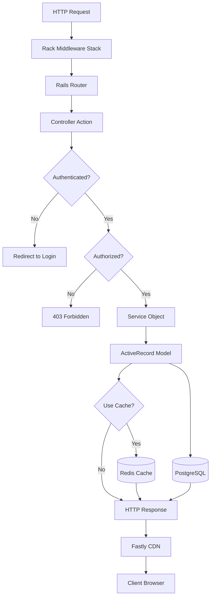
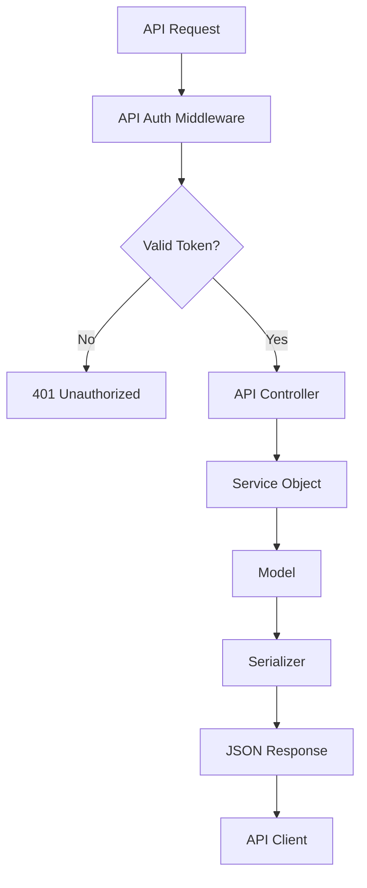
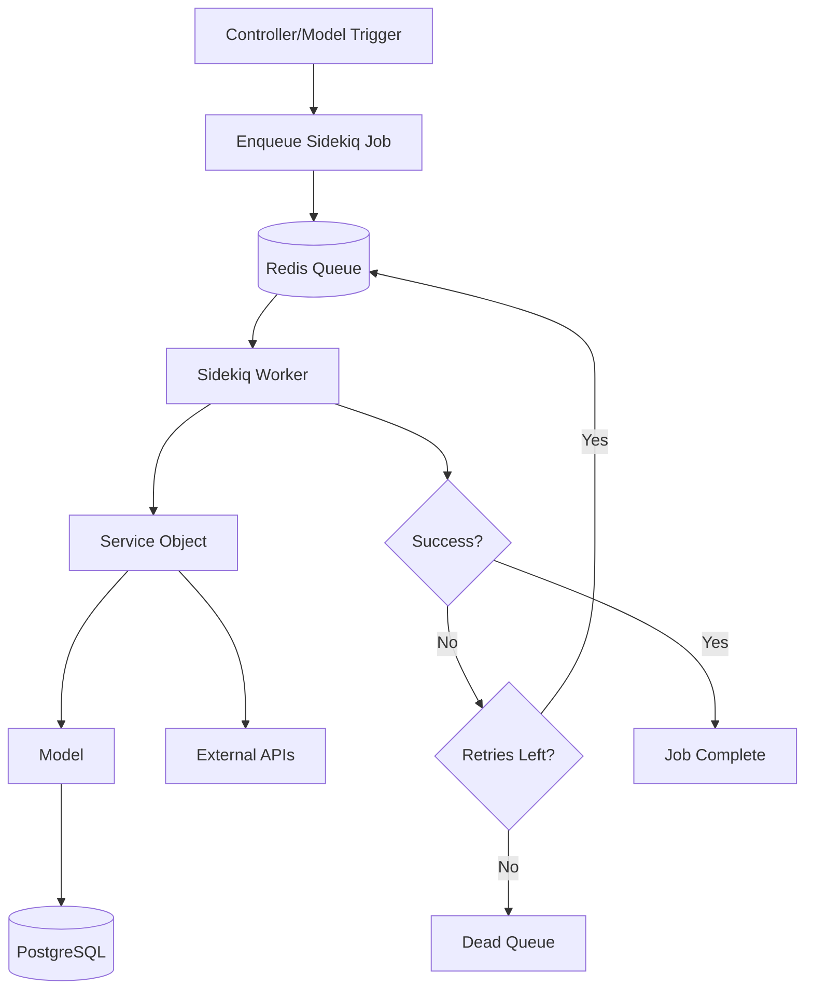

# Forem/DEV.to System Architecture Documentation

## Table of Contents

1. [System Overview](#system-overview)
2. [Technology Stack](#technology-stack)
3. [Architectural Patterns](#architectural-patterns)
4. [Main Components & Modules](#main-components--modules)
5. [Request Flow](#request-flow)
6. [Key Systems & Flows](#key-systems--flows)
7. [Areas for Senior Rails Developer Growth](#areas-for-senior-rails-developer-growth)
8. [Code Organization Principles](#code-organization-principles)

---

## System Overview

Forem is a Rails-based community platform that powers dev.to and other community sites. It's a **monolithic Rails application** with a modern frontend (Preact/React), designed to handle high traffic and complex community interactions.

### Core Capabilities

* **Content Management**: Articles, comments, podcasts, pages
* **User Management**: Authentication, profiles, roles, permissions
* **Community Features**: Following, reactions, notifications, badges
* **Moderation**: Spam detection, content moderation, user management
* **Multi-tenancy**: Subforems (multi-community support)
* **API**: RESTful API for external integrations
* **Admin Panel**: Comprehensive admin interface
* **Search**: Algolia integration for content search
* **Caching**: Edge caching with Fastly, Redis caching
* **Background Jobs**: Sidekiq for async processing

---

## Technology Stack

### Backend

* **Framework**: Rails 7.0.8.4
* **Database**: PostgreSQL (with read replicas support)
* **Background Jobs**: Sidekiq (Redis-backed)
* **Search**: Algolia
* **Caching**: Redis, Fastly (CDN)
* **File Storage**: Cloudinary, S3
* **Authentication**: Devise + OmniAuth (GitHub, Twitter, Google, Apple, Facebook)
* **Authorization**: Pundit
* **API**: JSON API with versioning (v0, v1)
* **Monitoring**: Honeybadger, Datadog, Honeycomb

### Frontend

* **Framework**: Preact/React (transitioning from ERB)
* **Build Tools**: esbuild, Webpack
* **Styling**: SCSS, Crayons design system
* **State Management**: React Context, Redux (legacy)

### Infrastructure

* **Web Server**: Puma
* **CDN**: Fastly
* **Email**: SendGrid/Mailchimp
* **Payments**: Stripe
* **Push Notifications**: Rpush (Redis-backed)

---

## Architectural Patterns

### 1. Service Object Pattern

**Location**: `app/services/`

Services encapsulate business logic outside of models and controllers. They follow a consistent pattern:

```ruby
# Pattern 1: Class method with .call
class Users::Delete
  def self.call(user)
    new(user).call
  end
  
  def initialize(user)
    @user = user
  end
  
  def call
    # Business logic here
  end
end

# Usage: Users::Delete.call(user)

# Pattern 2: Module with .call
module Authentication
  class Authenticator
    def self.call(...)
      new(...).call
    end
  end
end
```

**Key Services**:
* `Users::Delete` - User deletion logic
* `Articles::Creator` - Article creation
* `Authentication::Authenticator` - OAuth authentication
* `Notifications::*` - Notification creation logic
* `EdgeCache::Bust` - Cache invalidation

### 2. Query Object Pattern

**Location**: `app/queries/`

Query objects encapsulate complex database queries:

```ruby
module Admin
  module GDPRDeleteRequestsQuery
    def self.call(relation: ::GDPRDeleteRequest.all, search: {})
      relation = search_relation(relation, search) if search.presence
      relation.order(created_at: :desc)
    end
  end
end
```

**Benefits**: Reusable, testable, separates query logic from controllers.

### 3. Policy Object Pattern (Pundit)

**Location**: `app/policies/`

Authorization logic is centralized in policy classes:

```ruby
class ArticlePolicy < ApplicationPolicy
  def update?
    user.present? && (record.user == user || user.admin?)
  end
end
```

**Usage in Controllers**:
```ruby
def update
  @article = Article.find(params[:id])
  authorize @article
  # ... update logic
end
```

### 4. Worker Pattern (Sidekiq)

**Location**: `app/workers/`

Background jobs are organized by domain:

```
app/workers/
  ├── users/
  │   ├── delete_worker.rb
  │   └── update_user_activities_worker.rb
  ├── articles/
  │   ├── publish_worker.rb
  │   └── bust_cache_worker.rb
  └── notifications/
      └── new_reaction_worker.rb
```

**Pattern**:
```ruby
module Users
  class DeleteWorker
    include Sidekiq::Job
    
    sidekiq_options queue: :high_priority, retry: 10
    
    def perform(user_id, admin_delete = false)
      user = User.find_by(id: user_id)
      return unless user
      
      Users::Delete.call(user)
      # ... additional logic
    end
  end
end
```

### 5. Decorator Pattern

**Location**: `app/decorators/`

Decorators add presentation logic to models without modifying them:

```ruby
class ArticleDecorator < SimpleDelegator
  def formatted_published_date
    published_at.strftime("%B %d, %Y")
  end
end
```

### 6. Form Object Pattern

**Location**: `app/forms/`

Complex forms are handled by form objects:

```ruby
class CreatorSettingsForm
  include ActiveModel::Model
  
  attr_accessor :user, :settings
  
  def save
    return false unless valid?
    # Save logic
  end
end
```

### 7. Serializer Pattern

**Location**: `app/serializers/`

API responses are serialized using custom serializers:

```ruby
class ArticleSerializer
  def initialize(article)
    @article = article
  end
  
  def as_json
    {
      id: @article.id,
      title: @article.title,
      # ...
    }
  end
end
```

### 8. View Object Pattern

**Location**: `app/view_objects/`

View objects encapsulate complex view logic:

```ruby
class DashboardView
  def initialize(user)
    @user = user
  end
  
  def articles
    @user.articles.published
  end
end
```

---

## Main Components & Modules

### 1. Controllers (`app/controllers/`)

**Structure**:
```
controllers/
  ├── application_controller.rb      # Base controller
  ├── admin/                         # Admin namespace
  │   ├── application_controller.rb
  │   └── [admin controllers]
  ├── api/                           # API namespace
  │   ├── v0/                        # API v0
  │   └── v1/                        # API v1
  ├── concerns/                      # Shared controller logic
  └── [feature controllers]          # Articles, Comments, etc.
```

**Key Concerns**:
* `SessionCurrentUser` - User session management
* `ValidRequest` - Request validation
* `CachingHeaders` - Cache control headers
* `ImageUploads` - Image upload handling

### 2. Models (`app/models/`)

**Core Models**:
* `User` - User accounts with roles (Rolify)
* `Article` - Blog posts/articles
* `Comment` - Comments on articles
* `Tag` - Content tags
* `Organization` - User organizations
* `Podcast` / `PodcastEpisode` - Podcast content
* `Notification` - User notifications
* `Reaction` - Likes/reactions
* `Follow` - User follows
* `Badge` / `BadgeAchievement` - User badges

**Key Patterns**:
* **Concerns**: Models use `concerning` blocks for organization
* **Scopes**: Extensive use of ActiveRecord scopes
* **Callbacks**: Strategic use of callbacks for cache busting, notifications
* **Counter Caches**: Using `counter_culture` gem

### 3. Services (`app/services/`)

**Organization by Domain**:
```
services/
  ├── users/              # User-related services
  ├── articles/           # Article-related services
  ├── notifications/      # Notification services
  ├── authentication/    # Auth services
  ├── ai/                # AI/ML services
  ├── edge_cache/        # Cache management
  ├── badges/            # Badge awarding
  └── [domain]/          # Other domain services
```

**Key Services**:
* `Users::Delete` - Comprehensive user deletion
* `Articles::Creator` - Article creation with validation
* `Notifications::Create` - Notification creation
* `Authentication::Authenticator` - OAuth handling
* `EdgeCache::Bust` - Cache invalidation

### 4. Workers (`app/workers/`)

**Organization**:
* Organized by domain (users, articles, notifications, etc.)
* Uses Sidekiq for background processing
* Retry logic and error handling built-in
* Queue prioritization (high_priority, low_priority, etc.)

**Key Workers**:
* `Users::DeleteWorker` - Async user deletion
* `Articles::PublishWorker` - Article publishing
* `Notifications::*` - Various notification workers
* `Emails::SendUserDigestWorker` - Email digests

### 5. Policies (`app/policies/`)

**Authorization Layer**:
* Uses Pundit gem
* Policy per model/resource
* Centralized authorization logic
* Supports role-based access control

### 6. Queries (`app/queries/`)

**Query Objects**:
* Encapsulate complex queries
* Reusable across controllers
* Testable in isolation
* Support search/filtering

### 7. Views (`app/views/`)

**Structure**:
* ERB templates (legacy)
* Preact/React components (new)
* Partial templates for reuse
* Layouts for page structure

### 8. JavaScript (`app/javascript/`)

**Frontend Architecture**:
* Preact/React components
* Component-based architecture
* State management with Context API
* Service workers for offline support

---

## Request Flow

### Standard Web Request Flow



### API Request Flow



### Background Job Flow



---

## Key Systems & Flows

### 1. User Authentication Flow

**Components Involved**:
* `OmniauthCallbacksController`
* `Authentication::Authenticator`
* `Authentication::Providers::*`
* `Users::CreateFromAuthentication`

**Flow**:
1. User clicks "Sign in with GitHub/Twitter/etc."
2. OAuth redirect to provider
3. Provider callback to `OmniauthCallbacksController`
4. `Authentication::Authenticator` processes auth payload
5. Creates/updates user and identity records
6. Signs user in via Devise
7. Redirects to appropriate page

### 2. Article Publishing Flow

**Components**:
* `ArticlesController#create`
* `Articles::Creator`
* `Articles::PublishWorker`
* `Articles::BustCacheWorker`

**Flow**:
1. User submits article form
2. `Articles::Creator` validates and creates draft
3. If publishing: `Articles::PublishWorker` enqueued
4. Worker processes article (spam check, indexing, etc.)
5. Cache busting workers enqueued
6. Notifications sent to followers
7. Article appears in feed

### 3. Notification System

**Components**:
* `Notifications::Create`
* `Notifications::*Worker` (various workers)
* `Notification` model
* Real-time updates via ActionCable (if enabled)

**Flow**:
1. Event occurs (reaction, comment, follow, etc.)
2. Appropriate notification worker enqueued
3. Worker calls `Notifications::Create`
4. Notification record created
5. Email notification sent (if enabled)
6. Push notification sent (if enabled)
7. Real-time update sent to user

### 4. Caching Strategy

**Layers**:
1. **Fastly (Edge Cache)**: HTML pages, static assets
2. **Redis**: Application-level caching, sessions
3. **Memory Cache**: Request-level caching (RequestStore)
4. **Database Query Cache**: ActiveRecord query cache

**Cache Busting**:
* `EdgeCache::Bust` service
* Workers for async cache invalidation
* Automatic cache busting on model updates

### 5. Search System

**Components**:
* Algolia integration
* `AlgoliaSearchable` concern
* `ArticleApiIndexService`
* Search workers for indexing

**Flow**:
1. Model includes `AlgoliaSearchable`
2. On create/update, index to Algolia
3. Search queries hit Algolia API
4. Results returned and displayed

### 6. Moderation System

**Components**:
* `ModerationsController`
* `Moderator::*` services
* Spam detection services
* `FeedbackMessage` model

**Flow**:
1. Content flagged or auto-detected as spam
2. Moderation queue updated
3. Moderator reviews and takes action
4. User notified of decision
5. Audit log created

---

## Areas for Senior Rails Developer Growth

### 1. **Service Object Architecture**

**Why Important**: 
* Encapsulates business logic
* Makes code testable and reusable
* Separates concerns from controllers/models

**Study These**:
* `app/services/users/delete.rb` - Complex deletion logic
* `app/services/articles/creator.rb` - Multi-step creation process
* `app/services/authentication/authenticator.rb` - Strategy pattern

**Key Learnings**:
* When to use services vs. model methods
* Service composition patterns
* Error handling in services
* Testing service objects

### 2. **Background Job Patterns**

**Why Important**:
* Handles async processing
* Critical for performance
* Error handling and retries

**Study These**:
* `app/workers/users/delete_worker.rb` - Complex async operations
* `app/workers/articles/publish_worker.rb` - Publishing pipeline
* `app/workers/notifications/*` - Notification workers

**Key Learnings**:
* Job idempotency
* Retry strategies
* Queue prioritization
* Dead letter queues
* Job dependencies

### 3. **Authorization & Security**

**Why Important**:
* Security is critical
* Complex permission systems
* Role-based access control

**Study These**:
* `app/policies/application_policy.rb` - Base policy
* `app/policies/article_policy.rb` - Resource policies
* `app/models/user.rb` - Role management (Rolify)

**Key Learnings**:
* Pundit policy patterns
* Role-based authorization
* Security best practices
* Testing authorization

### 4. **Caching Strategies**

**Why Important**:
* Performance optimization
* Scalability
* Complex invalidation logic

**Study These**:
* `app/services/edge_cache/bust.rb` - Cache invalidation
* `app/lib/memory_first_cache.rb` - Multi-layer caching
* `app/controllers/concerns/caching_headers.rb` - Cache headers

**Key Learnings**:
* Cache invalidation strategies
* Multi-layer caching
* Cache warming
* Edge caching patterns

### 5. **Database Optimization**

**Why Important**:
* Query performance
* N+1 prevention
* Database scaling

**Study These**:
* `app/models/` - Model associations and scopes
* `app/queries/` - Query objects
* Counter caches usage
* Database indexes

**Key Learnings**:
* Query optimization
* Eager loading strategies
* Database indexing
* Read replicas
* Query analysis tools (PGHero)

### 6. **API Design**

**Why Important**:
* External integrations
* Versioning strategies
* API performance

**Study These**:
* `app/controllers/api/v0/` - API v0
* `app/controllers/api/v1/` - API v1
* `app/serializers/` - Response serialization
* API versioning strategy

**Key Learnings**:
* RESTful API design
* API versioning
* Rate limiting
* API documentation
* Serialization patterns

### 7. **Multi-tenancy (Subforems)**

**Why Important**:
* Complex domain logic
* Data isolation
* Performance considerations

**Study These**:
* `app/models/subforem.rb` - Subforem model
* `app/controllers/application_controller.rb` - Subforem detection
* RequestStore usage for subforem context

**Key Learnings**:
* Multi-tenancy patterns
* Data isolation strategies
* Request context management
* Domain-based routing

### 8. **Error Handling & Monitoring**

**Why Important**:
* Production debugging
* Error tracking
* Performance monitoring

**Study These**:
* Honeybadger integration
* Error handling in workers
* Monitoring patterns
* Logging strategies

**Key Learnings**:
* Error tracking tools
* Structured logging
* Performance monitoring
* Alerting strategies

### 9. **Testing Patterns**

**Why Important**:
* Code quality
* Regression prevention
* Refactoring confidence

**Study These**:
* `spec/services/` - Service specs
* `spec/workers/` - Worker specs
* `spec/policies/` - Policy specs
* `cypress/e2e/` - E2E tests

**Key Learnings**:
* RSpec patterns
* FactoryBot usage
* Test organization
* E2E testing strategies

### 10. **Refactoring & Code Quality**

**Why Important**:
* Maintainability
* Technical debt management
* Code review skills

**Study These**:
* RuboCop configuration
* Code organization patterns
* Refactoring examples in git history
* Code review practices

**Key Learnings**:
* Refactoring techniques
* Code smell identification
* Design pattern application
* Legacy code modernization

---

## Code Organization Principles

### 1. **Domain-Driven Organization**

Code is organized by domain/feature:
* `app/services/users/` - All user-related services
* `app/workers/users/` - All user-related workers
* `app/controllers/users_controller.rb` - User controller

### 2. **Separation of Concerns**

* **Controllers**: Handle HTTP requests/responses
* **Services**: Business logic
* **Models**: Data persistence and basic validations
* **Workers**: Async processing
* **Policies**: Authorization

### 3. **Consistent Naming**

* Services: `Domain::Action` (e.g., `Users::Delete`)
* Workers: `Domain::ActionWorker` (e.g., `Users::DeleteWorker`)
* Policies: `ResourcePolicy` (e.g., `ArticlePolicy`)
* Queries: `Domain::ResourceQuery` (e.g., `Admin::GDPRDeleteRequestsQuery`)

### 4. **DRY (Don't Repeat Yourself)**

* Shared logic in concerns
* Reusable services
* Query objects for complex queries
* Helper methods for view logic

### 5. **Testability**

* Services are easily testable
* Workers can be tested in isolation
* Policies have comprehensive specs
* Models have unit tests

### 6. **Performance Awareness**

* Background jobs for heavy operations
* Caching strategies throughout
* Database query optimization
* Edge caching for static content

---

## Additional Resources

### Internal Documentation
* `docs/` - Internal technical documentation
* `GDPR_DELETE_REQUEST_FLOW.md` - Example flow documentation
* Code comments and YARD documentation

### External Resources
* [Rails Guides](https://guides.rubyonrails.org/)
* [Sidekiq Best Practices](https://github.com/mperham/sidekiq/wiki/Best-Practices)
* [Pundit Documentation](https://github.com/varvet/pundit)
* [Forem Developer Docs](https://developers.forem.com/)

---

## Conclusion

This codebase demonstrates **enterprise-level Rails architecture** with:

* **Clear separation of concerns** through service objects, workers, and policies
* **Scalability** through caching, background jobs, and database optimization
* **Maintainability** through consistent patterns and organization
* **Security** through comprehensive authorization and validation
* **Performance** through strategic caching and async processing

As a senior Rails developer, focusing on these areas will help you:
1. Understand complex Rails applications
2. Make architectural decisions
3. Optimize performance
4. Maintain code quality
5. Lead technical initiatives

**Next Steps**:
1. Pick one area to deep dive into
2. Read the actual implementation code
3. Write tests to understand behavior
4. Refactor or extend functionality
5. Review PRs to see how others approach problems

