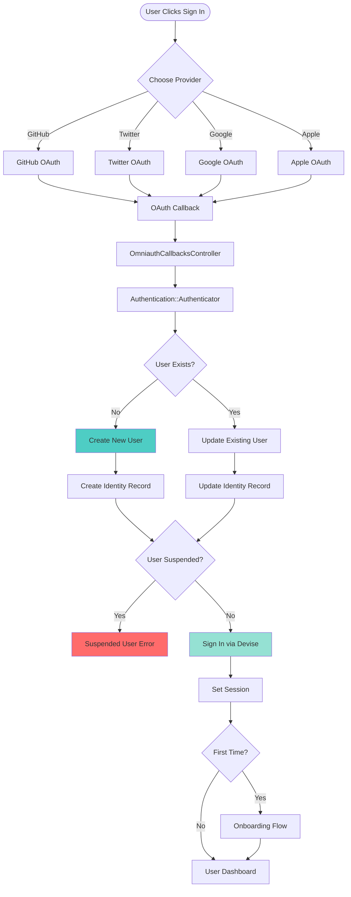
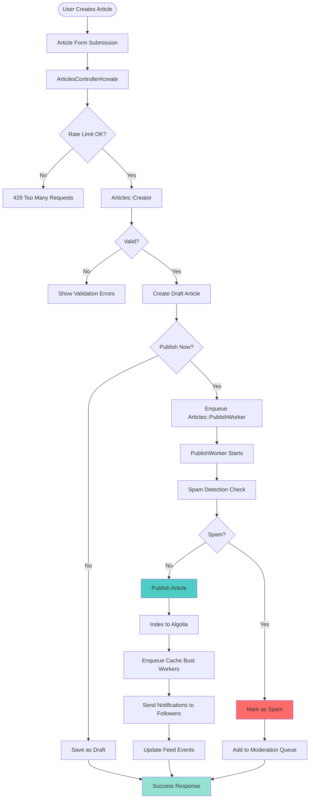
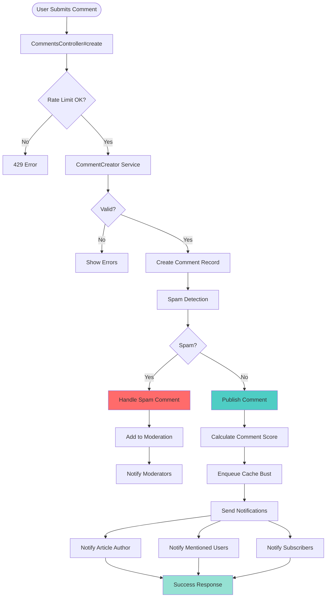
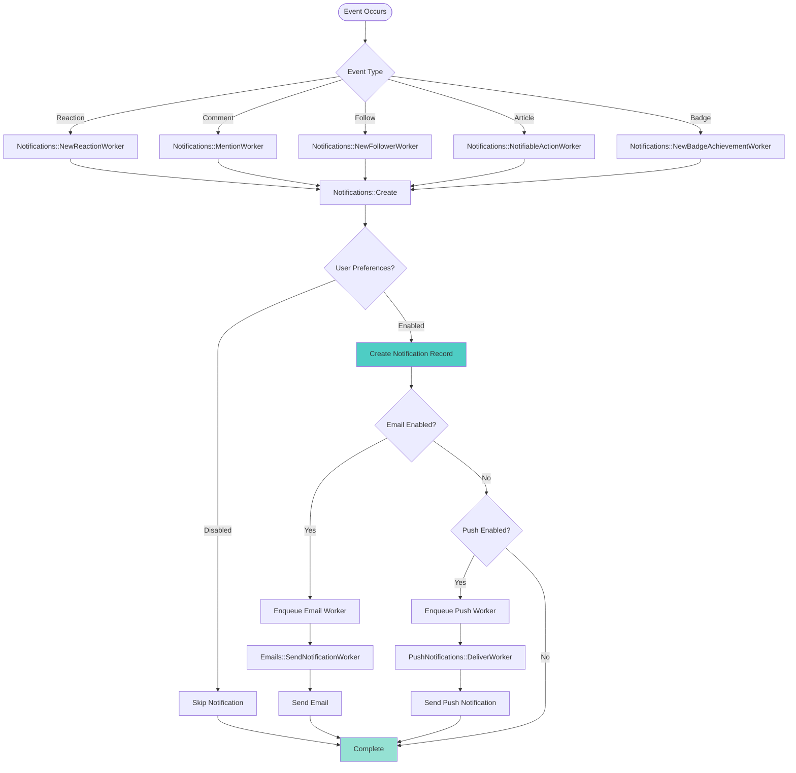
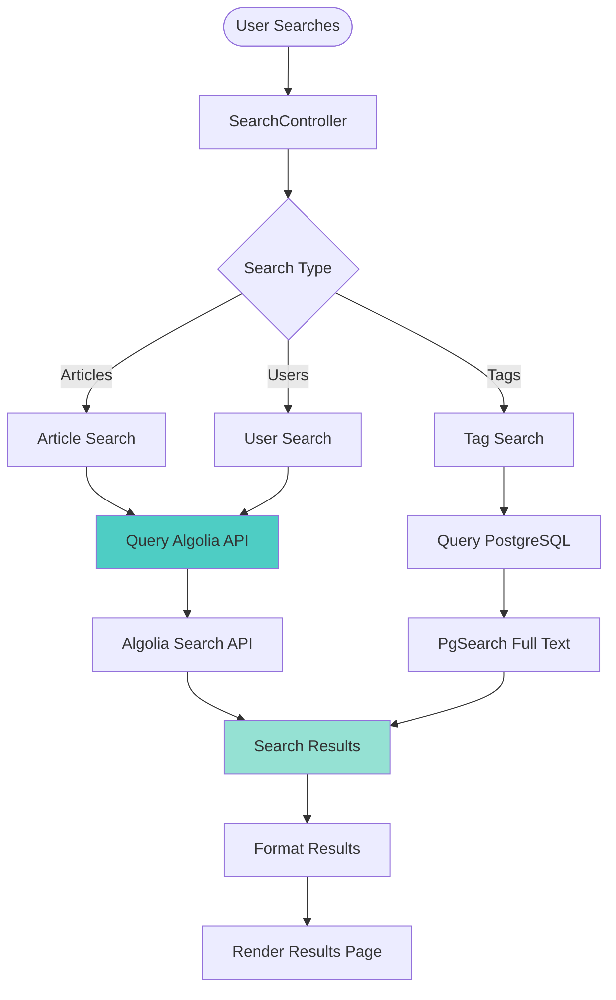
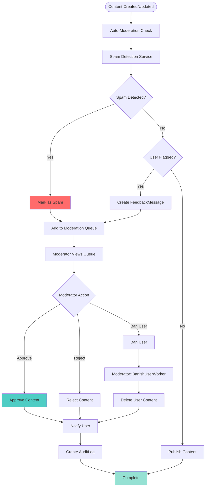
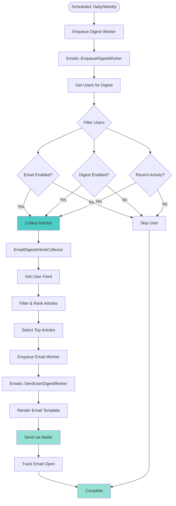

# System Flow Diagrams

This document provides visual flow diagrams for major systems in the Forem/DEV.to codebase.

## Table of Contents

1. [User Authentication Flow](#user-authentication-flow)
2. [Article Publishing Flow](#article-publishing-flow)
3. [Comment Creation Flow](#comment-creation-flow)
4. [Notification System Flow](#notification-system-flow)
5. [User Deletion Flow (GDPR)](#user-deletion-flow-gdpr)
6. [Search Flow](#search-flow)
7. [Moderation Flow](#moderation-flow)
8. [Email Digest Flow](#email-digest-flow)

---

## User Authentication Flow

**Key Components**:
* `OmniauthCallbacksController` - Handles OAuth callbacks
* `Authentication::Authenticator` - Processes auth payload
* `Authentication::Providers::*` - Provider-specific logic
* `Users::CreateFromAuthentication` - User creation logic

---

## Article Publishing Flow

**Key Components**:
* `ArticlesController` - HTTP endpoint
* `Articles::Creator` - Creation logic
* `Articles::PublishWorker` - Async publishing
* `Articles::BustCacheWorker` - Cache invalidation
* `Notifications::Create` - Notification creation

---

## Comment Creation Flow

**Key Components**:
* `CommentsController` - HTTP endpoint
* `CommentCreator` - Comment creation service
* `Comments::CalculateScore` - Score calculation
* `Comments::BustCacheWorker` - Cache invalidation
* `Notifications::Create` - Notification creation

---

## Notification System Flow

**Key Components**:
* `Notifications::Create` - Notification creation service
* `Notifications::*Worker` - Various notification workers
* `Emails::SendNotificationWorker` - Email notifications
* `PushNotifications::DeliverWorker` - Push notifications
* `Notification` model - Notification records

---

## User Deletion Flow (GDPR)

See `GDPR_DELETE_REQUEST_FLOW.md` for detailed documentation.

```mermaid
flowchart TD
    Start([User Requests Deletion]) --> RequestDestroy[UsersController#request_destroy]
    RequestDestroy --> GenerateToken[Generate Deletion Token]
    GenerateToken --> SendEmail[Send Confirmation Email]
    SendEmail --> UserConfirms[User Confirms Deletion]

    UserConfirms --> EnqueueWorker[Enqueue Users::DeleteWorker]
    EnqueueWorker --> WorkerStart[DeleteWorker Starts]

    WorkerStart --> UsersDelete[Users::Delete.call]
    UsersDelete --> DeleteComments[Delete Comments]
    DeleteComments --> DeleteArticles[Delete Articles]
    DeleteArticles --> DeleteActivity[Delete User Activity]
    DeleteActivity --> CancelStripe[Cancel Stripe Subscriptions]
    CancelStripe --> RemoveMailchimp[Remove from Mailchimp]
    RemoveMailchimp --> DestroyUser[Destroy User Record]

    DestroyUser --> CreateGDPR[Create GDPRDeleteRequest]
    CreateGDPR --> SendDeletionEmail[Send Deletion Confirmation]
    SendDeletionEmail --> AdminPhase[Admin Confirmation Phase]

    AdminPhase --> AdminView[Admin Views Requests]
    AdminView --> AdminConfirm[Admin Confirms Deletion]
    AdminConfirm --> DestroyGDPR[Destroy GDPRDeleteRequest]
    DestroyGDPR --> CreateAuditLog[Create AuditLog]
    CreateAuditLog --> Complete[Complete]

    style DestroyUser fill:#ff6b6b
    style CreateGDPR fill:#4ecdc4
    style Complete fill:#95e1d3
```

---

## Search Flow

**Key Components**:
* `SearchController` - Search endpoint
* `AlgoliaSearchable` concern - Algolia integration
* `PgSearch` - PostgreSQL full-text search
* `ArticleApiIndexService` - Algolia indexing

---

## Moderation Flow

**Key Components**:
* `ModerationsController` - Moderation interface
* `Moderator::*` services - Moderation actions
* `Spam::*` services - Spam detection
* `FeedbackMessage` model - User reports
* `Moderator::BanishUserWorker` - User banning

---

## Email Digest Flow

**Key Components**:
* `Emails::EnqueueDigestWorker` - Digest scheduling
* `Emails::SendUserDigestWorker` - Individual digest sending
* `EmailDigestArticleCollector` - Article collection logic
* `EmailDigest` service - Digest generation

---

## Key Takeaways

### Common Patterns Across Flows

1. **Rate Limiting**: Most user actions check rate limits first
2. **Spam Detection**: Content creation includes spam checks
3. **Async Processing**: Heavy operations use background workers
4. **Cache Busting**: Content changes trigger cache invalidation
5. **Notifications**: Events trigger notification creation
6. **Error Handling**: Comprehensive error handling throughout
7. **Audit Logging**: Important actions create audit logs

### Performance Considerations

* **Background Jobs**: Heavy operations are async
* **Caching**: Aggressive caching at multiple layers
* **Database Optimization**: Efficient queries and indexing
* **CDN**: Edge caching for static content
* **Rate Limiting**: Prevents abuse and overload

### Security Considerations

* **Authentication**: OAuth and token-based auth
* **Authorization**: Policy-based access control
* **Rate Limiting**: Prevents abuse
* **Spam Detection**: Content filtering
* **Input Validation**: Comprehensive validation
* **Audit Logging**: Track important actions

---

## How to Use These Diagrams

1. **Understanding Flow**: Use these diagrams to understand how features work end-to-end
2. **Debugging**: Trace through flows when debugging issues
3. **Onboarding**: Help new developers understand the system
4. **Architecture Decisions**: Reference when making architectural changes
5. **Documentation**: Keep diagrams updated as code changes

---

## Updating These Diagrams

When making changes to flows:
1. Update the relevant diagram
2. Update the component list
3. Update the key takeaways if patterns change
4. Keep diagrams synchronized with code
